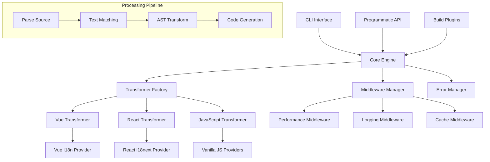
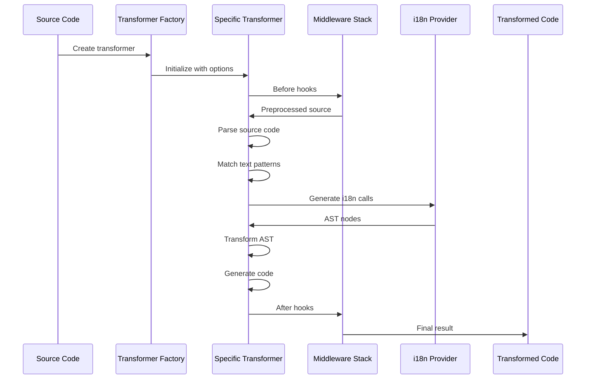

# i18nCraft Architecture 🏗️

> Modern, modular architecture for professional internationalization automation

## 📋 Table of Contents

- [Overview](#overview)
- [Core Architecture](#core-architecture)
- [Module Structure](#module-structure)
- [Transformation Pipeline](#transformation-pipeline)
- [Provider System](#provider-system)
- [Middleware System](#middleware-system)
- [Error Handling](#error-handling)
- [Performance Optimization](#performance-optimization)
- [Extensibility](#extensibility)

## Overview

i18nCraft follows a **layered, modular architecture** designed for:

- 🎯 **Separation of Concerns**: Each module has a clear, single responsibility
- 🔧 **Extensibility**: Easy to add new frameworks, providers, and transformations
- ⚡ **Performance**: Optimized for speed and memory efficiency
- 🛡️ **Reliability**: Comprehensive error handling and recovery mechanisms
- 🧪 **Testability**: Each component is independently testable

## Core Architecture



## Module Structure

### 📁 Directory Layout

```
src/
├── core/                   # Core transformation engine
│   ├── transformer/        # Base transformer classes
│   │   ├── base.ts         # Abstract transformer interface
│   │   ├── vue.ts          # Vue-specific implementation
│   │   ├── react.ts        # React-specific implementation
│   │   ├── javascript.ts   # Vanilla JS implementation
│   │   └── index.ts        # Transformer factory
│   ├── providers/          # i18n library adapters
│   │   ├── base.ts         # Provider interface
│   │   ├── vue-i18n.ts     # Vue I18n integration
│   │   ├── react-i18next.ts # React i18next integration
│   │   ├── vanilla-js.ts   # Vanilla JS providers
│   │   └── index.ts        # Provider exports
│   ├── parsers/            # AST parsing utilities
│   │   ├── recast-parser.ts # JavaScript AST parser
│   │   └── index.ts        # Parser exports
│   ├── middleware/         # Processing middleware
│   │   ├── base.ts         # Middleware interface
│   │   ├── performance.ts  # Performance monitoring
│   │   ├── logging.ts      # Logging middleware
│   │   ├── cache.ts        # Caching middleware
│   │   ├── error.ts        # Error handling
│   │   ├── manager.ts      # Middleware manager
│   │   └── index.ts        # Middleware exports
│   ├── matcher.ts          # Text matching engine
│   ├── errors.ts           # Error definitions
│   └── transform.ts        # Legacy compatibility
├── plugins/                # Build tool integrations
│   ├── unplugin.ts         # Universal plugin
│   ├── vite.ts             # Vite plugin
│   ├── webpack.ts          # Webpack plugin
│   └── index.ts            # Plugin exports
├── cli/                    # Command-line interface
│   ├── index.ts            # CLI implementation
│   └── commands/           # CLI commands
├── config/                 # Configuration management
│   ├── types.ts            # Config type definitions
│   ├── defaults.ts         # Default configurations
│   ├── validator.ts        # Config validation
│   └── manager.ts          # Config manager
├── utils/                  # Utility functions
│   ├── error-handler.ts    # Error handling utilities
│   ├── errors.ts           # Error definitions
│   └── index.ts            # Utility exports
├── types/                  # TypeScript definitions
│   └── index.ts            # Type exports
└── index.ts                # Main entry point
```

## Transformation Pipeline

### 🔄 Processing Flow



### 🎯 Transformation Stages

#### 1. **Source Parsing**
```typescript
// Vue SFC parsing
const { descriptor } = parse(sourceCode)
const templateContent = descriptor.template?.content
const scriptContent = descriptor.script?.content

// React/JS parsing
const ast = parse(sourceCode, { 
  sourceType: 'module', 
  plugins: ['jsx', 'typescript'] 
})
```

#### 2. **Text Matching**
```typescript
// Intelligent text pattern matching
class TextMatcher {
  match(text: string): string | false {
    // Smart pattern recognition
    // Locale key generation
    // Duplicate detection
  }
}
```

#### 3. **AST Transformation**
```typescript
// Provider-based code generation
interface I18nProvider {
  createTranslationAst(key: string): Node
  createScopedTranslationAst(key: string, scope?: string): Node
}
```

#### 4. **Code Generation**
```typescript
// Framework-specific output
const result = generate(transformedAst, {
  compact: false,
  retainLines: true
})
```

## Provider System

### 🔌 Provider Interface

```typescript
interface I18nProvider {
  /**
   * Create AST node for translation call
   */
  createTranslationAst(key: string): Node
  
  /**
   * Create AST node for scoped translation
   */
  createScopedTranslationAst(key: string, scope?: string): Node
  
  /**
   * Get required imports for this provider
   */
  getRequiredImports?(): ImportDeclaration[]
  
  /**
   * Transform existing translation calls
   */
  transformExistingCall?(node: Node): Node | null
}
```

### 🎨 Built-in Providers

#### Vue I18n Provider
```typescript
export const VueI18nProvider: I18nProvider = {
  createTranslationAst: (key: string) => 
    t.callExpression(
      t.memberExpression(t.thisExpression(), t.identifier('$t')),
      [t.stringLiteral(key)]
    )
}
```

#### React i18next Provider
```typescript
export const ReactI18nextProvider: I18nProvider = {
  createTranslationAst: (key: string) =>
    t.callExpression(t.identifier('t'), [t.stringLiteral(key)]),
  
  getRequiredImports: () => [
    t.importDeclaration(
      [t.importSpecifier(t.identifier('useTranslation'), t.identifier('useTranslation'))],
      t.stringLiteral('react-i18next')
    )
  ]
}
```

#### Vanilla JavaScript Providers
```typescript
// Multiple vanilla providers for different use cases
export const VanillaI18nProvider: I18nProvider = {
  createTranslationAst: (key: string) =>
    t.callExpression(
      t.memberExpression(t.identifier('i18n'), t.identifier('t')),
      [t.stringLiteral(key)]
    )
}

export const VanillaFunctionProvider: I18nProvider = {
  createTranslationAst: (key: string) =>
    t.callExpression(t.identifier('translate'), [t.stringLiteral(key)])
}
```

## Middleware System

### 🔗 Middleware Architecture

```typescript
interface TransformMiddleware {
  name: string
  priority: number
  before?: (source: string, options: TransformOptions) => string | Promise<string>
  after?: (result: TransformResult, options: TransformOptions) => TransformResult | Promise<TransformResult>
}
```

### 🧩 Built-in Middleware

#### Performance Middleware
```typescript
export const performanceMiddleware: TransformMiddleware = {
  name: 'performance',
  priority: 1,
  before: (source, options) => {
    console.time(`transform-${options.filename}`)
    return source
  },
  after: (result, options) => {
    console.timeEnd(`transform-${options.filename}`)
    return result
  }
}
```

#### Cache Middleware
```typescript
export const cacheMiddleware: TransformMiddleware = {
  name: 'cache',
  priority: 10,
  before: async (source, options) => {
    const cached = await cache.get(source)
    if (cached) return cached
    return source
  },
  after: async (result, options) => {
    await cache.set(result.originalSource, result)
    return result
  }
}
```

## Error Handling

### 🛡️ Error Management System

```typescript
// Custom error types with context
export class I18nCraftError extends Error {
  constructor(
    public code: ErrorCode,
    message: string,
    public context?: Record<string, any>,
    public suggestions?: string[]
  ) {
    super(message)
  }
}

// Error codes for different scenarios
export enum ErrorCode {
  PARSE_ERROR = 'PARSE_ERROR',
  TRANSFORM_ERROR = 'TRANSFORM_ERROR',
  PROVIDER_ERROR = 'PROVIDER_ERROR',
  CONFIG_ERROR = 'CONFIG_ERROR',
  FILE_ERROR = 'FILE_ERROR'
}
```

### 🔄 Error Recovery

```typescript
// Graceful error handling with recovery
export function handleTransformError(
  error: Error, 
  source: string, 
  options: TransformOptions
): TransformResult {
  if (error instanceof I18nCraftError) {
    // Structured error handling
    logError(error, { source, options })
    
    // Attempt recovery
    return {
      code: source, // Return original on error
      matches: [],
      errors: [error]
    }
  }
  
  // Unknown error - wrap and rethrow
  throw new I18nCraftError(
    ErrorCode.TRANSFORM_ERROR,
    'Unknown transformation error',
    { originalError: error.message }
  )
}
```

## Performance Optimization

### ⚡ Optimization Strategies

#### 1. **Smart Caching**
```typescript
// Multi-level caching system
interface CacheManager {
  // In-memory cache for frequent patterns
  patternCache: Map<string, string>
  
  // File-level result cache
  resultCache: Map<string, TransformResult>
  
  // Persistent cache for large projects
  diskCache: DiskCache
}
```

#### 2. **Optimized Text Matching**
```typescript
// Efficient regex patterns with single-pass processing
class OptimizedMatcher {
  private readonly patterns = [
    // Vue directives (processed first to avoid conflicts)
    /(v-(?:text|html))="'([^']+)'"/g,
    
    // Dynamic attributes
    /(?::(\w+)|v-bind:(\w+))="'([^']+)'"/g,
    
    // Static attributes
    /(\w+)="([^"]+)"/g,
    
    // Text content (processed last)
    />([^<]+)</g
  ]
}
```

#### 3. **Memory Efficiency**
```typescript
// Stream processing for large files
export async function* processLargeFile(
  filePath: string, 
  options: TransformOptions
): AsyncGenerator<TransformResult> {
  const stream = createReadStream(filePath)
  
  for await (const chunk of stream) {
    yield await transformChunk(chunk, options)
  }
}
```

## Extensibility

### 🔧 Extension Points

#### 1. **Custom Transformers**
```typescript
// Extend base transformer for new frameworks
export class AngularTransformer extends BaseTransformer {
  protected parse(): any {
    // Angular-specific parsing logic
  }
  
  protected async transformAST(ast: any): Promise<any> {
    // Angular-specific transformation
  }
}
```

#### 2. **Custom Providers**
```typescript
// Create provider for custom i18n library
export const CustomI18nProvider: I18nProvider = {
  createTranslationAst: (key: string) =>
    t.callExpression(
      t.memberExpression(
        t.identifier('customI18n'),
        t.identifier('translate')
      ),
      [t.stringLiteral(key)]
    )
}
```

#### 3. **Custom Middleware**
```typescript
// Add custom processing logic
export const validationMiddleware: TransformMiddleware = {
  name: 'validation',
  priority: 5,
  before: (source, options) => {
    // Validate source before transformation
    validateSource(source)
    return source
  },
  after: (result, options) => {
    // Validate result after transformation
    validateResult(result)
    return result
  }
}
```

### 🎯 Plugin Development

```typescript
// Create build tool plugins
export function createCustomPlugin(options: PluginOptions) {
  return {
    name: 'i18ncraft-custom',
    transform(code: string, id: string) {
      if (shouldTransform(id)) {
        return transformCode(code, options)
      }
    }
  }
}
```

## Best Practices

### 📋 Development Guidelines

1. **Follow SOLID Principles**
   - Single Responsibility: Each class has one clear purpose
   - Open/Closed: Extensible without modification
   - Liskov Substitution: Subclasses are interchangeable
   - Interface Segregation: Small, focused interfaces
   - Dependency Inversion: Depend on abstractions

2. **Error Handling**
   - Always provide context with errors
   - Include recovery suggestions when possible
   - Log errors appropriately for debugging
   - Fail gracefully with fallback behavior

3. **Performance**
   - Cache expensive operations
   - Use single-pass processing when possible
   - Optimize regex patterns for common cases
   - Profile and measure performance improvements

4. **Testing**
   - Unit test each component in isolation
   - Integration tests for complete workflows
   - Performance tests for optimization validation
   - Error scenario testing for robustness

5. **Documentation**
   - Document public APIs thoroughly
   - Provide examples for complex features
   - Keep architecture documentation updated
   - Include migration guides for breaking changes

---

This architecture enables i18nCraft to be both powerful and maintainable, supporting current needs while remaining flexible for future enhancements. 
